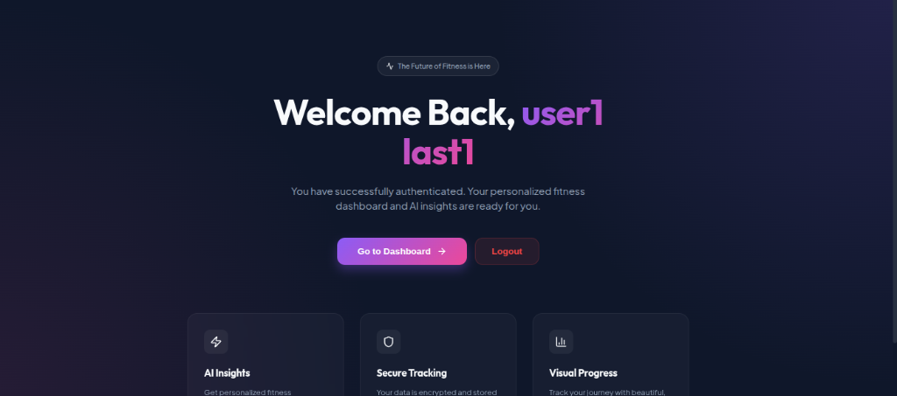
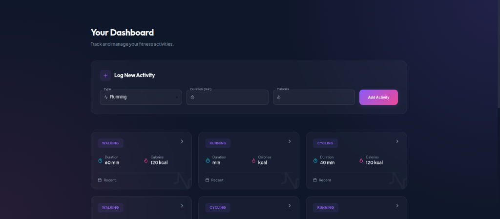
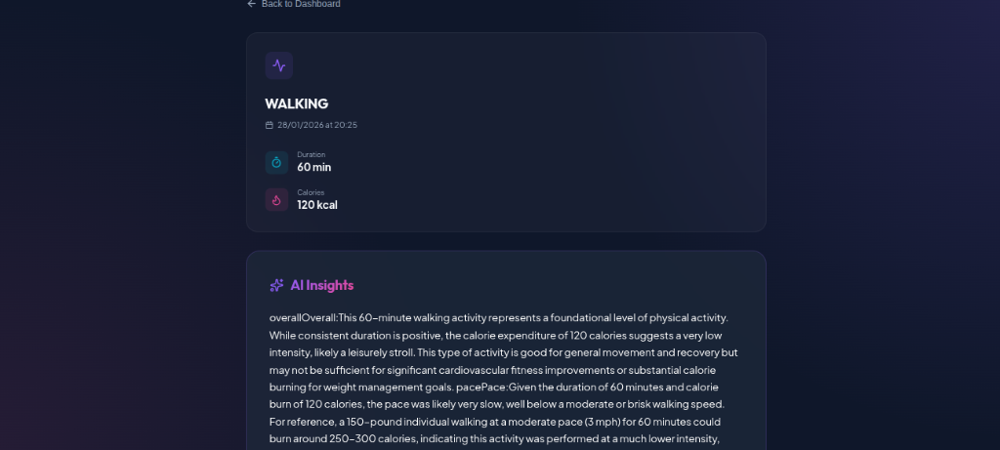
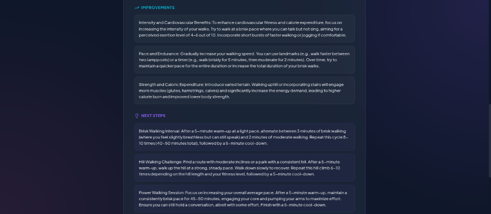
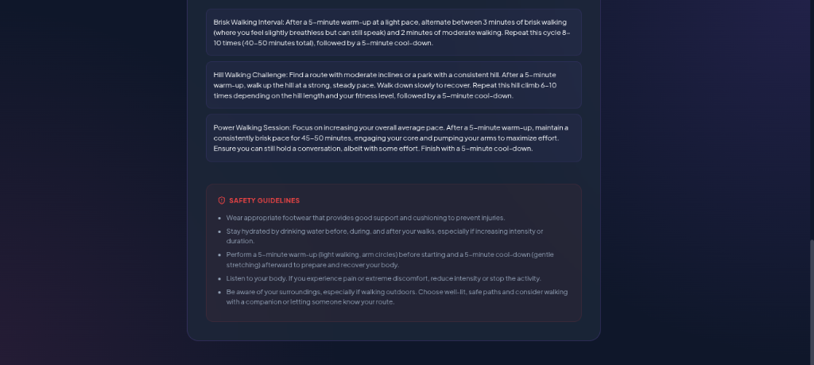

# AuraFit | AI-Powered Fitness Ecosystem

AuraFit is a state-of-the-art fitness tracking and AI recommendation platform built with a robust Java Microservices architecture and a high-performance React frontend.

## 🚀 Architecture Overview

The project is built using a microservices pattern, ensuring scalability, resilience, and high availability.

### Backend Microservices (Java / Spring Boot)
- **Gateway**: Central entry point using Spring Cloud Gateway.
- **Eureka Server**: Service discovery for all microservices.
- **Config Server**: Centralized configuration management.
- **User Service**: Handles user registration, profiles, and authentication via Keycloak.
- **Activity Service**: Manages fitness activity logging and tracking (MongoDB).
- **AI Service**: Provides intelligent fitness insights and personalized recommendations.

### Frontend (React / Vite)
- **AuraFit Web**: A premium, glassmorphic UI built with React, Redux Toolkit, and Framer Motion.
- **Authentication**: Secure OIDC flow integrated with Keycloak (PKCE).

## � Screenshots

### 🏠 Landing Page
The entry point for users, featuring a personalized welcome message and secure authentication options.


### 📊 User Dashboard
A centralized hub for logging new activities and viewing a history of fitness sessions.


### 🧠 AI Insights & Activity Details
Deep dives into specific activities with AI-generated recommendations, improvements, and safety guidelines.




## �🛠️ Tech Stack
- **Backend**: Java 17+, Spring Boot 3, Spring Cloud, Spring Data MongoDB, RabbitMQ.
- **Frontend**: React 19, Vite, Redux Toolkit, Material UI, Framer Motion, Lucide Icons.
- **Infrastructure**: Keycloak (Auth), MongoDB (Database), RabbitMQ (Messaging).

## 🏁 Getting Started

### Prerequisites
- JDK 17 or higher
- Node.js 18+
- Docker (for Keycloak, MongoDB, RabbitMQ)
- Maven

### Running the Project
1. **Start Infrastructure**: Ensure Keycloak, MongoDB, and RabbitMQ are running.
2. **Start Config Server**: Run the `configserver` microservice.
3. **Start Eureka**: Run the `eureka` microservice.
4. **Start Microservices**: Run `userservice`, `activityservice`, `aiservice`, and `gateway`.
5. **Start Frontend**:
   ```bash
   cd fitness-app-frontend
   npm install
   npm run dev
   ```

## 📄 License
This project is licensed under the MIT License.
